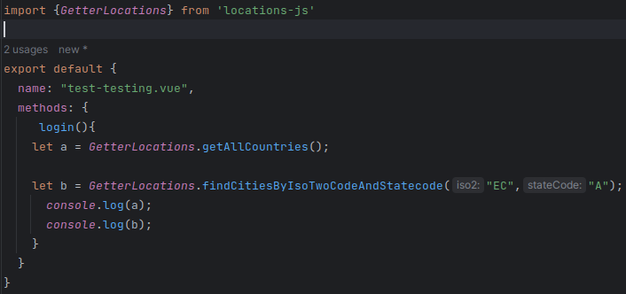

# Locations-js

Lib for use more easy the json databases countries+cities+states belonging to https://github.com/dr5hn/countries-states-cities-database

## Getting started

Locations js!!!!!

How can use this lib?

## Methods

### getAllCountries

### findCountryByIsoTwoCodeWithStates

### findCountryByIsoTwoCodeWithStatesAndCities

### findStatesByIsoTwoCode

### findCitiesByIsoTwoCodeAndStatecode

## Command to make sushi roll locations

docker-compose exec r-base Rscript ./utils/fragmentFile.R "jsonData/countries+states+cities.json" "dist/Infrastructure/Repositories/JsonDB/JsonData/fragments/" 4